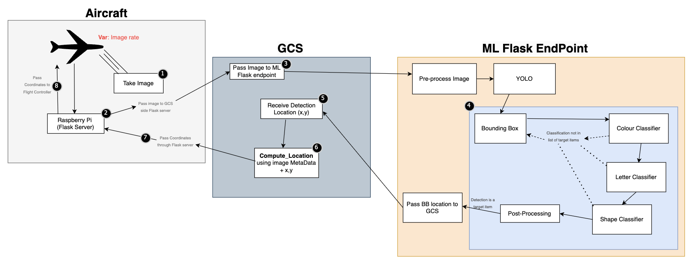

# 2025-ML

This repo contains the object detection and classification algorithms developed to identify, classify, and determine the spatial coordinates of target objects.

## Specs
- **Framework**: All models are written using **Tensorflow**.

- **Model Architecture**: Utilizes three separate CNN models:
  - **Object Classifier**: Determines the object within the proposed ROI.
  - **Color Classifier**: Identifies the dominant colour of the object within the proposed ROI. The model incorporates a tolerance mechanism to adapt to different illumination levels in different environments.

<br>

- **Object Detection Backbone**:
  - **YOLOv8**: Real-time object detection. Achieves very high processing speed.

## WorkFlow




## Installation Instructions
```bash
# Clone the repository
git clone https://github.com/SchulichUAV/2025ML.git
# Install required dependencies
pip install -r requirements.txt
```

## File Structure
```bash
├── README.md                  
├── requirements.txt           
├── Doc-Resources/             # Documentation resources
├── Models/                    # Saved Models (from training scripts)
├── Data/                      # Stored datasets
|    ├── Raw_Data/             # Original dataset images
|    ├── Test_Data/            # Images used for testing models 
|    └── Train_Data/           # Images used for training
├── Models/                    # Saved and trained models
├── Scripts/                   # All scripts
|    ├── Pipeline/             # Files used to construct the pipeline
|    └── Training/             # Model training scripts
└── Utils/                     # Utility functions
```

## Before Training
- Before starting any model training, ensure you run the augmentation script to generate the necessary training and test datasets. 
  
  Run the augmentation script:
  ```bash
  python Scripts/Augmentation.py
  ```
- Make sure to have the raw image data ready in the specified directory (Raw_Data) before running the script.

## Training the Models
Example:
```bash
python scripts/<MODEL>.py --epochs 50 --batch_size 32
```

## Running the Models
Example:
```bash

```