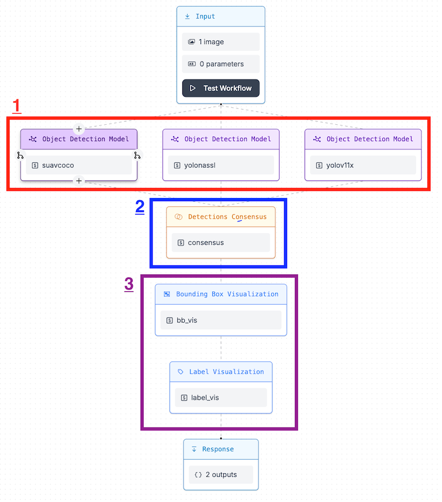

# **2025-ML**
This repository contains the object detection and classification algorithms designed to identify and classify target objects with high accuracy and confidence.

---

## **Key Features**
- The system utilizes **three object detection models** running in parallel.
- Predictions from all models are combined through a **voting consensus mechanism** to ensure confident results.
- Developed and trained using **RoboFlow** workflows

---

## **Architecture Overview**



### **Process Flow**
1. **Input & Pre-Processing**
   - Input image passed through pre-processing stages to prepare it for detection.

2. **Stage 1: Detection**
   - Models run **independently in parallel** to process the input image.
   - Each model applies a **confidence threshold of 0.4** to filter out low-confidence predictions.

3. **Stage 2: Voting**
   - A **voting system** consolidates predictions from the three models.
   - Detections are validated if at least **two models agree** on the object.
   - The smallest bounding box is applied to the common detection for precise localization.

4. **Visualization**
   - Bounding boxes and labels for validated detections are generated for final output.

---

## **Workflow**


---

## **Installation Instructions**
Follow these steps to set up and run the project:

### **1. Clone the Repository**
```bash
# Clone the Repository
git clone https://github.com/SchulichUAV/2025ML.git
cd 2025ML
# Install required dependencies
pip install -r requirements.txt
```

### **2. Set Up the Docker Environment**

#### **Option 1: Using Docker for Local Inference**

Ensure Docker is installed and configured on your system.
  ```bash
  # Pull the Docker image and start the container
  inference server start --port 9001
  ```

**Benefits of Using Docker**:
- Enables offline inference
- Provides faster local detections

#### **Option 2: Using the Roboflow API**
If you prefer not to use Docker, you can run the models directly using the Roboflow API. Update the `api_url` in the code to:
`https://detect.roboflow.com`


### **3. Run the Models**
```bash
cd Scripts
python Detection.py
```